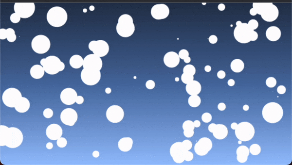

# particle floating



## Particle class

: 파티클 하나에 대한 정보(x, y, x방향, y방향, 크기, 색)설정

### draw()

: 파티클의 모양을 캔버스에 그린다

### update()

: 현재의 방항이 화면 가드에 닿으면 방항을 바꾼 후
파티클의 x, y 값에 방향을 += 해주면서 draw() 해준다

## particles.init()

```
const init = () => {
  // 화면 리사이즈가 되면 파티클 공간을 초기화 한다.
    particleArray = [];

    for (let i = 0; i < 100; i += 1) {
      const size = Math.random() * 20;
      const x = Math.random() * (canvas.width - size);
      const y = Math.random() * (canvas.height - size);

      // 각 방향의 속도 설정
      const directionX = Math.random() * 0.9 - 0.4;
      const directionY = Math.random() * 0.9 - 0.3;
      const color = 'white';

      particleArray.push(new Particle(x, y, directionX, directionY, size, color));
    } // for
  };
```

```
window.addEventListener('resize', () => {
  // 처음 canvas의 크기를 화면 크기로 설정 후
  // css에서 width:100%, height: 100% 설정 후
  // 화면 크기가 변하면 처음 설정된 상태로 그려진 그림 크기에서
  // 늘려지거나 좁혀져서 이미지가 찌그러 진다
  // 화면 너비가 변경될 떄마다 canvas의 사이즈를 변경 해주면
  // 그림들도 그 사이즈에 맞춰 다시 그려지도록 한다.
  canvas.width = window.innerWidth;
  canvas.height = window.innerHeight;
  paticles.init();
});

```
